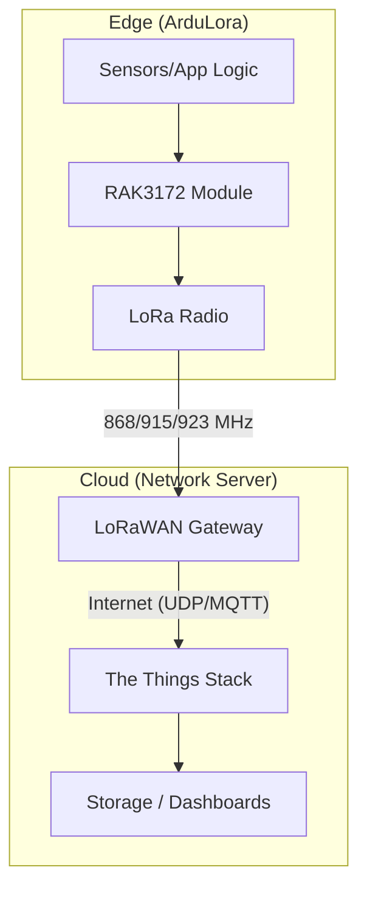
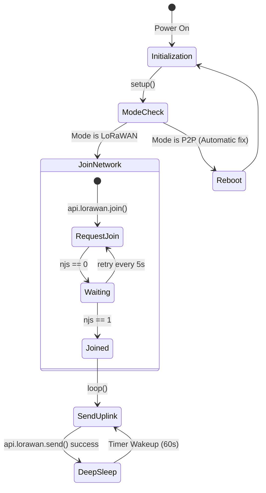
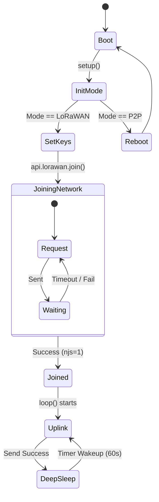
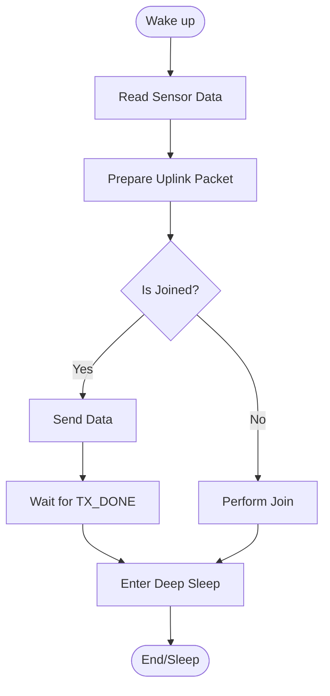
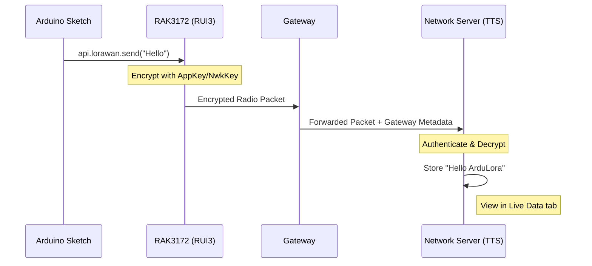
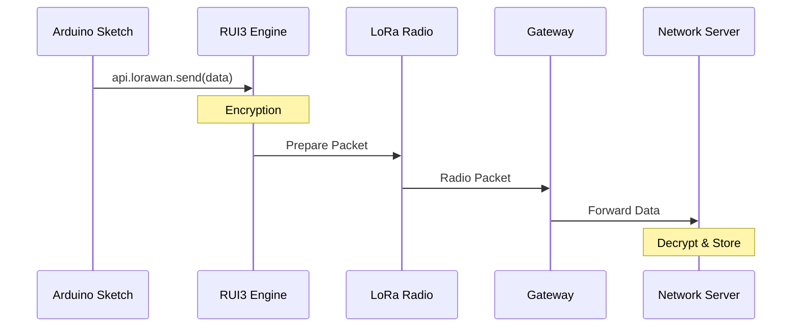

# 🚀 ArduLora LoRaWAN Beginner's Guide

Welcome to the **ArduLora** LoRaWAN guide! This document is designed to help "newbies" get their first LoRaWAN message sent using the ArduLora (RAK3172) board.

---

## 🛠 1. Hardware Preparation

To get started, you will need:
- **ArduLora Board** (RAK3172-based)
- **LoRa Antenna** (Must be connected before powering on!)
- **USB-C Cable**
- **LoRaWAN Gateway** nearby (or use a public network like The Things Network)

> [!NOTE]
> ArduLora features a power-control pin (**PB5**) that must be set to `LOW` to power on external sensors connected to the board's headers.


---

## 💻 2. Software Setup

### Step 1: Install Arduino IDE
Download and install the latest [Arduino IDE](https://www.arduino.cc/en/software).

### Step 2: Install RUI3 Board Support Package (BSP)
1. Open Arduino IDE.
2. Go to **File > Preferences**.
3. In **Additional Boards Manager URLs**, add:
   `https://raw.githubusercontent.com/RAKWireless/RAKwireless-Arduino-BSP-Index/main/package_rakwireless.com_rui_index.json`
4. Go to **Tools > Board > Boards Manager**.
5. Search for `RAK` and install **RAKwireless RUI STM32 Boards**.

### Step 3: Select Your Board
1. Go to **Tools > Board > RAKWireless RUI STM32 Modules**.
2. Select **WisDuo RAK3172 Evaluation Board**.
3. Select the correct **COM Port** under **Tools > Port**.

---

## 🌐 3. Register Your Device (OTAA)

Before your board can talk to the network, you need to register it on a LoRaWAN Network Server (like [The Things Stack](https://www.thethingsnetwork.org/)).

You will need these 3 keys:
1. **DevEUI**: Device's unique ID (8 bytes).
2. **AppEUI**: Application ID (8 bytes - often all zeros).
3. **AppKey**: Security key (16 bytes).

> [!TIP]
> You can find your **DevEUI** by running the `LoRaWan_Info` example or looking at the sticker on the RAK3172 module.

---

## 📝 4. Simple Demo Code

Copy this code into your Arduino IDE. It will send a "Hello ArduLora" message every 60 seconds.

```cpp
/**
 * ArduLora Simple LoRaWAN Demo (OTAA)
 * Sends a "Hello" packet every 60 seconds.
 */

// 1. Configure your keys here (MSB format)
uint8_t node_device_eui[8] = {0x00, 0x00, 0x00, 0x00, 0x00, 0x00, 0x00, 0x00};
uint8_t node_app_eui[8]    = {0x00, 0x00, 0x00, 0x00, 0x00, 0x00, 0x00, 0x00};
uint8_t node_app_key[16]   = {0x00, 0x00, 0x00, 0x00, 0x00, 0x00, 0x00, 0x00, 0x00, 0x00, 0x00, 0x00, 0x00, 0x00, 0x00, 0x00};

// 2. Set your Region (e.g., RAK_REGION_EU868, RAK_REGION_US915, RAK_REGION_AS923)
#define MY_REGION RAK_REGION_AS923

#define SLEEP_TIME 60000 // 60 seconds

void setup() {
  Serial.begin(115200);
  delay(2000);
  Serial.println("--- ArduLora LoRaWAN Demo ---");

  // Check if we are in LoRaWAN mode
  if (api.lorawan.nwm.get() != 1) {
    api.lorawan.nwm.set(1);
    api.system.reboot();
  }

  // Set OTAA credentials
  api.lorawan.deui.set(node_device_eui, 8);
  api.lorawan.appeui.set(node_app_eui, 8);
  api.lorawan.appkey.set(node_app_key, 16);
  api.lorawan.band.set(MY_REGION);
  
  // Set Class A and Join
  api.lorawan.deviceClass.set(RAK_LORA_CLASS_A);
  api.lorawan.njm.set(RAK_LORA_OTAA);
  
  Serial.println("Joining Network...");
  api.lorawan.join();

  // Wait for Join Success
  while (api.lorawan.njs.get() == 0) {
    Serial.print(".");
    delay(5000);
  }
  Serial.println("\nJoined Success!");
}

void loop() {
  Serial.println("Sending Uplink...");
  
  // Simple payload: "Hello"
  uint8_t data[] = "Hello ArduLora";
  
  if (api.lorawan.send(sizeof(data), data, 2)) {
    Serial.println("Packet queued successfully!");
  } else {
    Serial.println("Send failed!");
  }

  // Deep Sleep to save battery
  Serial.printf("Sleeping for %d ms...\n", SLEEP_TIME);
  api.system.sleep.all(SLEEP_TIME);
}
```

---

## 🔍 5. Detailed Code Explanation

Here is a breakdown of each part of the code to help you understand how it works:

### A. Configuration Credentials
- **`node_device_eui`, `node_app_eui`, `node_app_key`**: These are the "ID Card" and "Password" for your device. You must obtain these from your network server (like The Things Network) and paste them here.
- **`MY_REGION`**: Sets the frequency band for your country. For example, `RAK_REGION_EU868` for Europe or `RAK_REGION_AS923` for most of Southeast Asia.
- **`SLEEP_TIME`**: The interval between each data transmission (set to 60,000ms or 60 seconds).

### B. `setup()` Function (Initial Setup)
- **`api.lorawan.nwm.get()`**: Checks if the board is in LoRaWAN mode (1) or LoRa P2P mode (0). If it's not in LoRaWAN mode, it switches and reboots automatically.
- **`api.lorawan.deui.set(...)`**: Loads your unique credentials into the RAK3172 module.
- **`api.lorawan.njm.set(RAK_LORA_OTAA)`**: Sets the activation mode to OTAA (Over-The-Air Activation), which is the most secure and standard method.
- **`api.lorawan.join()`**: Commands the board to start searching for a gateway and request to join the network.
- **`while (api.lorawan.njs.get() == 0)`**: A loop that waits until the "Join" process is successful. It prints a dot to the Serial Monitor every 5 seconds while waiting.

### C. `loop()` Function (Main Loop)
- **`uint8_t data[] = "Hello ArduLora"`**: Creates a data packet containing the message you want to send.
- **`api.lorawan.send(...)`**: Sends the packet to the LoRaWAN server.
- **`api.system.sleep.all(SLEEP_TIME)`**: This is crucial for battery-powered devices. The board enters "Deep Sleep" mode to save power and will wake up automatically after 60 seconds to send the next message.

---

## 🚀 6. How to Run

1. **Paste** the code above into Arduino IDE.
2. **Update** the `node_device_eui`, `node_app_eui`, and `node_app_key` with your keys from your network console.
3. **Change** `MY_REGION` to match your country (e.g., `RAK_REGION_EU868`).
4. **Click Upload** (the arrow button).
5. **Open Serial Monitor** (**Tools > Serial Monitor**) and set baud rate to `115200`.

---

## 📊 7. Monitoring Your Data

Once your board is running, the data is sent to your **LoRaWAN Network Server (LNS)**. Here is how to see it:

### Viewing Live Data
1. Log in to your network console (e.g., [The Things Stack Console](https://console.cloud.thethings.network/)).
2. Go to **Applications > [Your Application Name] > Devices > [Your Device Name]**.
3. Click on the **Live Data** tab.
4. You will see "Uplink message" entries appearing every 60 seconds.

### Decoding the Payload
By default, the data is shown as a **Hexadecimal string** (e.g., `48 65 6C 6C 6F 20 41 72 64 75 4C 6F 72 61`).
To see the actual text:
- In The Things Stack, you can use a **Payload Formatter**.
- For this simple demo, you can use an online "Hex to ASCII" converter to verify that `48 65 6C 6C 6F...` translates to `Hello ArduLora`.

> [!IMPORTANT]
> In real IoT projects, we usually send data as small numbers (bytes) rather than text strings to save bandwidth and battery!

---

## 📐 8. Logic & Data Flow Diagrams

To better understand how the code and the system work together, here are the architectural diagrams.

### Software Design Diagram (SDD)
This diagram shows the high-level components of our LoRaWAN solution.



#### PlantUML Version
```mermaid
graph TD
    subgraph "Edge Layer"
        Sensors --> ArduLora[ArduLora RAK3172]
    end
    cloud "LoRaWAN Network" {
        Gateway
    }
    subgraph "Cloud Layer"
        TTS[The Things Stack] --> Dashboard
    end
    ArduLora -. Radio .-> Gateway
    Gateway --> TTS
```

### State Diagram
This shows the logical states of the ArduLora board while running the demo code.



#### PlantUML Version


### 🔋 9. Battery & Power Logic
For battery-powered devices, ArduLora spends 99% of its time sleeping.



> [!TIP]
> The `api.system.sleep.all(SLEEP_TIME)` command is the "Magic" that makes your battery last for years. It turns off everything except a tiny timer that wakes the board up later.

### Data Flow
How the "Hello ArduLora" string travels through the network.



#### PlantUML Version


---

## ❓ Troubleshooting

- **Join Fail?** Check if you are in range of a LoRaWAN gateway. Ensure your keys match exactly.
- **Antenna?** Never power on the board without the antenna, or you might damage the LoRa chip!
- **Not appearing in Serial Monitor?** Double-click the Reset button to force the board into Bootloader mode.

---
*Happy Coding with ArduLora!* 🛸