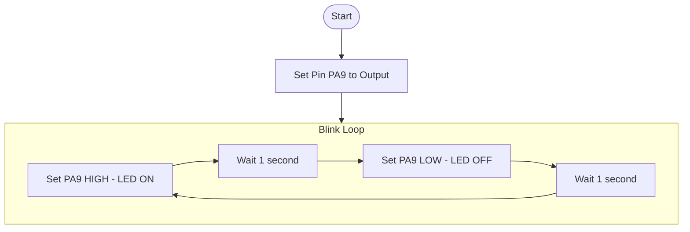
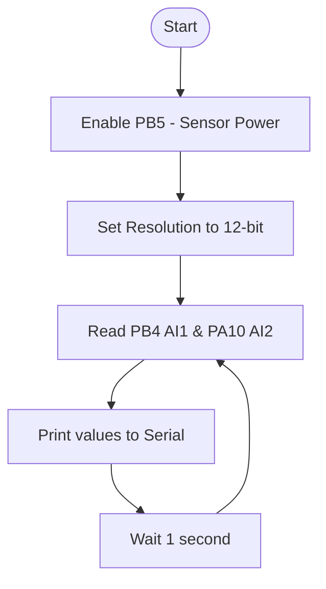
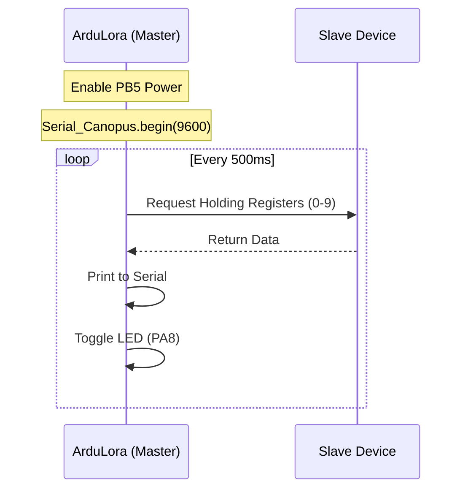
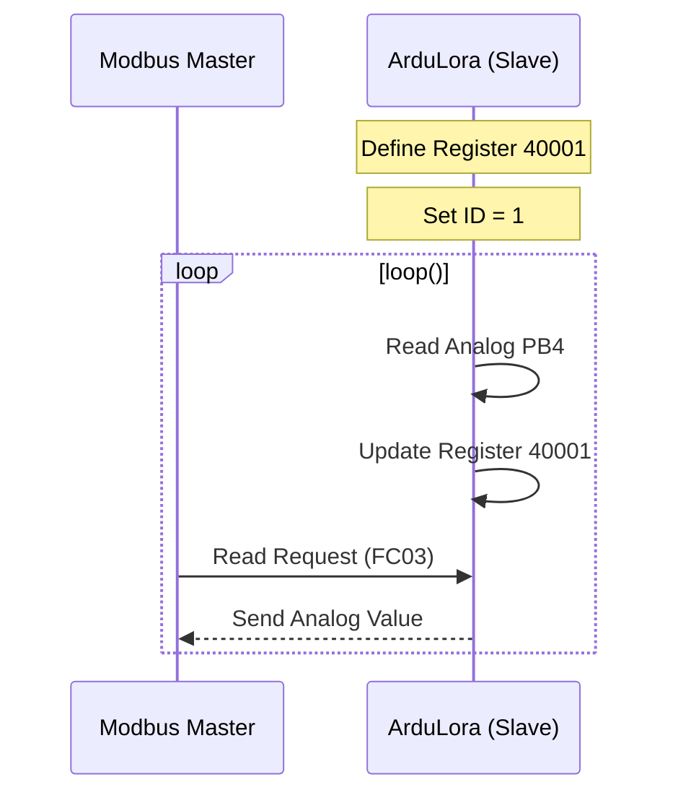
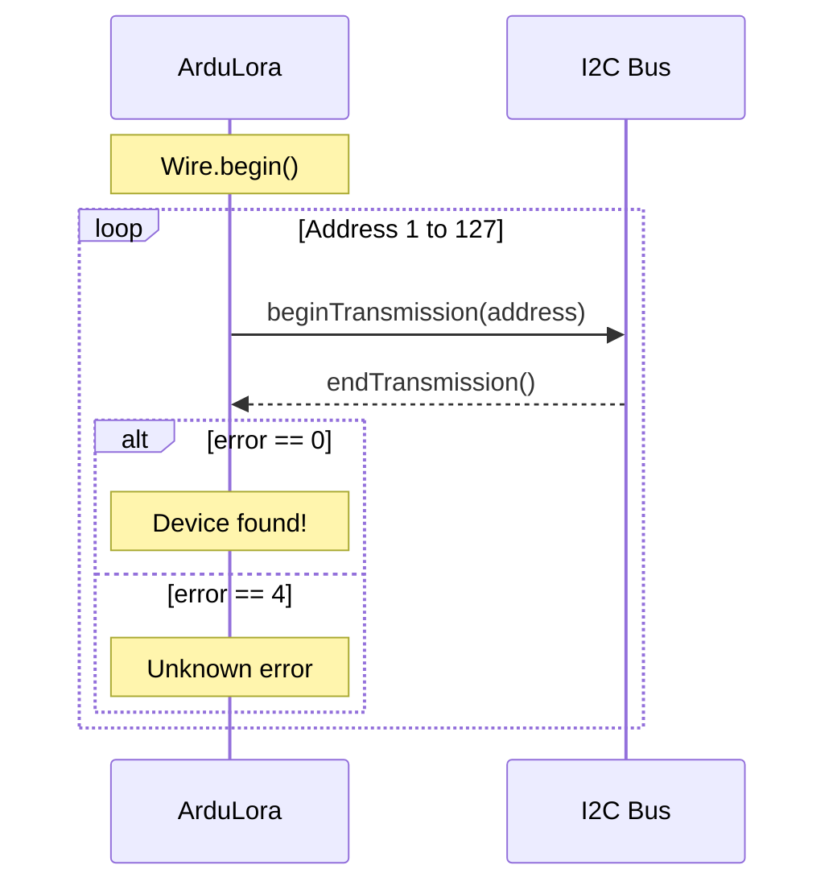
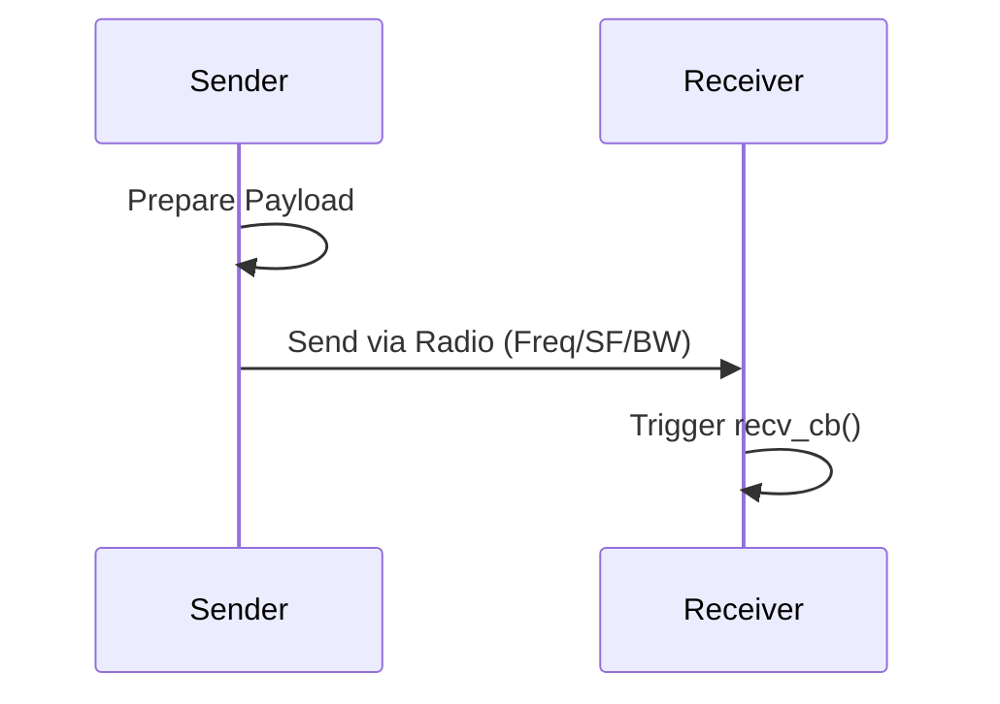
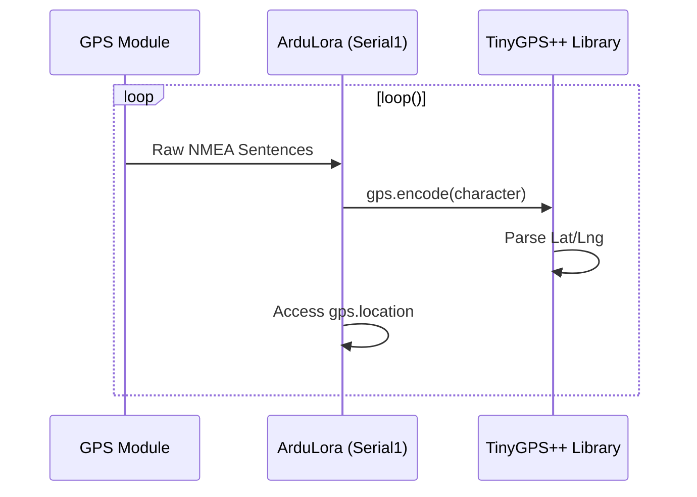

🛒 **Where to buy:**  
[](https://www.tindie.com/stores/thanhnamlt5/?ref=offsite_badges&utm_source=sellers_thanhnamlt5&utm_medium=badges&utm_campaign=badge_large) [](https://www.elecrow.com/ardulora.html) [](https://icdayroi.com/ardulora-board-phat-trien-lora-voi-arduino-ide-day-du-cong-rs485-i2c-uart)

🎫 **Tindie Discount code:** `canopus`
# ArduLora Board Quick Start Guide  

> [!IMPORTANT]
> **RUI3 v4.2.4 Compatibility:** All examples and documentation in this repository have been fully updated to comply with the latest RUI3 v4.x API namespaces (e.g., `api.lora.*`). Please ensure your RAK3172 module firmware is up to date. For more details on the API changes, see the [RUI3 v4.2.4 Release Notes](https://docs.rakwireless.com/release-notes/rui3/2026/v4.2.4/).

<p align="left">
<a href="https://fb.com/kuem0912" target="blank"></a>
<a href="https://wa.me/84969809444" target="blank"></a>


## Content
* [Information board](#Information-board)
	- [Version hardware log](#Version-hardware-log)
	- [Hardware Setup](#Hardware-Setup)
	- [ArduLora I/O pinout](#ArduLora-I/O-Pins)
	- [Library Installation](#Library-Installation)
* [Examples](#Examples)
	- [How to Use Digital IO](#How-to-Use-Digital-IO)
	- [How to Use Analog Input](#How-to-Use-Analog-Input)
	- [How to Use Modbus RTU](#How-to-Use-Modbus-RTU)
	- [How to Use I2C](#How-to-Use-I2C)
	- [How to use Lora P2P](#Lora-P2P)
	- [How to use LoraWan](#LoraWan)
	- [How to get information System](#System)


[](https://www.facebook.com/sharer/sharer.php?u=https://github.com/NamNamIoT/ArduLora)

##### Library Installation:  
1. Open Arduino IDE.
2. Go to **Sketch > Include Library > Add .ZIP Library...** (or search **ArduLora** in Library Manager once published).
3. Include it in your code: `#include <ArduLora.h>`

-[*Detailed Installation Guide*](https://github.com/NamNamIoT/ArduLora/blob/main/Readme_extension.md)  
  
## Information board   
#### Version hardware log   
🏷️**Rev1.0: [July-2025].**  


  
	   
🏷️**Rev1.1: [Sept-2025].**  
  </p>  


## Examples
### How to Use Digital IO  
##### Blink led  
- Use Arduino [digitalWrite](https://www.arduino.cc/reference/en/language/functions/digital-io/digitalwrite/) to write a HIGH or a LOW value to a Digital I/O pin.
  
> **tip 📝 NOTE:**  
> The GPIO Pin Name is the one to be used on the digitalRead and digitalWrite and NOT the pin numbers.
  
**Example code blink led on ArduLora board**



```c
void setup()
{
  pinMode(PA9, OUTPUT); // Set pin PA9 as an OUTPUT
}

void loop()
{
  digitalWrite(PA9, HIGH); // Turn the pin ON (3.3V)
  delay(1000);             // Wait for 1 second
  digitalWrite(PA9, LOW);  // Turn the pin OFF (0V)
  delay(1000);             // Wait for 1 second
}
```

🔍 **Code Explanation:**
*   **`pinMode(PA9, OUTPUT)`**: Tells the board that pin `PA9` will be used to send signals OUT (to an LED).
*   **`digitalWrite(PA9, HIGH)`**: Sends 3.3V to the pin, turning the LED on.
*   **`delay(1000)`**: Pauses the program for 1000 milliseconds (1 second).
[Click go top](#Information-board)

### How to Use Analog Input  
##### Read analog  
You can use any of the pins below as Analog Input.

| **Pin Name** | **Onboard** |
| ------------ | ----------- |
|  PB4         | AI1         |
|  PA10        | AI2         |


Use Arduino [analogRead](https://www.arduino.cc/reference/en/language/functions/analog-io/analogread/) to read the value from the specified Analog Input pin.
  
**Example code read analog on ArduLora board**



```c
void setup() {
  Serial.begin(115200);  // Initialize serial communication at 115200 baud rate.
  Serial.println("ArduLora Analog Example");  // Print a message indicating the start of the program.
  Serial.println("------------------------------------------------------");  // Print a separator line.
  //Enable power for external sensor
  pinMode(PB5, OUTPUT);
  digitalWrite(PB5, HIGH);
  analogReadResolution(12);  // Set analog read resolution to 12 bits.
}

void loop() {
  float AI1 = analogRead(PB4)*2.58;         // Read analog voltage from pin PB4 and store it in AI1.
  Serial.printf("AI1 = %0.0fmV\r\n", AI1); // Print the analog voltage value of AI1 in millivolts.

  float AI2 = analogRead(PA10)*2.58;         // Read analog voltage from pin PA10 and store it in AI2.
  Serial.printf("AI2 = %0.0fmV\r\n", AI2); // Print the analog voltage value of AI2 in millivolts.

  delay(1000);  // Wait for 1 second before the next iteration of the loop.
}

```

🔍 **Code Explanation:**
*   **`pinMode(PB5, OUTPUT)` & `digitalWrite(PB5, HIGH)`**: ArduLora has a power control pin (`PB5`) for external sensors. You must turn it ON to give power to your sensors.
*   **`analogReadResolution(12)`**: Sets the precision to 12-bit (0-4095), giving more accurate readings than standard Arduino (10-bit).
*   **`analogRead(PB4) * 2.58`**: Reads the raw voltage and converts it to millivolts using the board's scaling factor.
[Click go top](#Information-board)

### How to Use Modbus RTU  
##### Modbus master  
*This example, our board is modbus master.*



Modbus RTU use Serial1 on ArduLora board

| **Serial Port**   | **Serial Instance Assignment** |
| ----------------- | ------------------------------ |
| UART1 (pins 4, 5) | Serial1                        |


**Example Code modbus master read slave**

##### 📝Note: Make sure you have an ModbusRTU device connected to pin A and B on ArduLora board.

```c
#include "Canopus_Modbus.h"
ModbusMaster node;
uint8_t result;
void setup()
{
  //Enable power for external sensor
  pinMode(PB5, OUTPUT);
  digitalWrite(PB5, HIGH);

  // Led PA8 as output
  pinMode(PA8, OUTPUT);
  Serial.begin(115200);
  Serial.print("\r\n*****************ArduLora*******************");
  Serial_Canopus.begin(9600, SERIAL_8N1);
}
void loop()
{
  //***************READ node 1**************************
  node.begin(1, Serial_Canopus); //slave ID node
  Serial.printf("");
  Serial.printf("\r\n\n\nExample read modbus RTU for ArduLora board");

  result = node.readHoldingRegisters(0, 10);//Read 40000 to 40009
  delay(10);
  if (result == node.ku8MBSuccess) //Read success
  {
    for (uint8_t i = 0; i < 10; i ++ )
    {
      Serial.printf("\r\nValue 4000%d: %d", i, node.getResponseBuffer(i));
    }
  }
  else Serial.print("Read Fail node 1"); //read fail
  digitalWrite(PA8, !digitalRead(PA8)); //blink led
  delay(500);
}

```

🔍 **Code Explanation:**
*   **`ModbusMaster node`**: Creates a "Master" object to control other devices.
*   **`Serial_Canopus`**: A special serial port pre-configured for the Modbus pins on ArduLora.
*   **`node.readHoldingRegisters(0, 10)`**: Requests data from address 0 to 9 from the slave device.
*   **`node.getResponseBuffer(i)`**: Retrieves the actual value received from the sensor.

The Arduino Serial Monitor shows the value of register:

```c
Example read modbus RTU for ArduLora board
Value 40000: 1
Value 40001: 2
Value 40002: 3
Value 40003: 4
Value 40004: 5
Value 40005: 6
Value 40006: 7
Value 40007: 8
Value 40008: 9
Value 40009: 10
```
[Click go top](#Information-board)
  
##### Modbus slave  
*This example, our board is modbus **slave**. Board read analog at PB4 (AI1) and set value register 040001 (FC03, address 1)*  



**Example Code modbus slave update value register**

```c
#include "modbus.h"
#include "modbusDevice.h"
#include "modbusRegBank.h"
#include "modbusSlave.h"
modbusDevice regBank;
modbusSlave slave;

void setup()
{
  //Enable power for external sensor
  pinMode(PB5, OUTPUT);
  digitalWrite(PB5, HIGH);

  //Led PA8 as output
  pinMode(PA8, OUTPUT);
  Serial.begin(115200);
  Serial.print("\r\n*****************ArduLora*******************");
  
  regBank.setId(1);  //Set id slave
  regBank.add(40001);  //Add register FC03, holding register, address 1
  regBank.set(40001,0);  //Set default value for 40001 is 0
  slave._device = &regBank;
  slave.setBaud(9600); //Set baudrate 9600
  
  analogReadResolution(12);  //Set Resolution adc is 12bit, can upto 14bit
}
void loop()
{
  int analog_In = analogRead(PB4); 
  
  regBank.set(40001, analog_In);  //Update value for 40001 is analog_In
  slave.run();  //Run service modbus RTU slave
  digitalWrite(PA8, !digitalRead(PA8)); //blink led
  delay(200);
}
```

🔍 **Code Explanation:**
*   **`regBank.setId(1)`**: Sets the board as Modbus device ID #1.
*   **`regBank.add(40001)`**: Reserves a register address where other devices can read data.
*   **`slave.run()`**: The engine that listens for requests from the Modbus Master.
[Click go top](#Information-board)

### How to Use I2C

There is one I2C peripheral available on ArduLora.

| **I2C Pin Number** | **I2C Pin Name** |
| ------------------ | ---------------- |
| PA12               | I2C_SCL          |
| PA11               | I2C_SDA          |


- Use Arduino [Wire](https://www.arduino.cc/reference/en/language/functions/communication/wire/) library to communicate with I2C devices.

**Example Code I2C**  
***Scan I2C***  



Make sure you have an I2C device connected to specified I2C pins to run the I2C scanner code below:

```c
#include <Wire.h>
void setup()
{
  //Enable power for external sensor
  pinMode(PB5, OUTPUT);
  digitalWrite(PB5, HIGH);
  Wire.begin();
  Serial.begin(115200);
  while (!Serial);
  Serial.println("\nI2C Scanner");
}

void loop()
{
  byte error, address;
  int nDevices;
  Serial.println("Scanning...");
  nDevices = 0;
  for(address = 1; address < 127; address++ )
  {
    // The i2c_scanner uses the return value of
    // the Write.endTransmission to see if
    // a device did acknowledge to the address.
    Wire.beginTransmission(address);
    error = Wire.endTransmission();
    if (error == 0)
    {
      Serial.print("I2C device found at address 0x");
      if (address<16)
        Serial.print("0");
      Serial.print(address,HEX);
      Serial.println("  !");
      nDevices++;
    }
    else if (error==4)
    {
      Serial.print("Unknown error at address 0x");
      if (address<16)
        Serial.print("0");
      Serial.println(address,HEX);
    }
  }
  if (nDevices == 0)
    Serial.println("No I2C devices found\n");
  else
    Serial.println("done\n");
  delay(5000);           // wait 5 seconds for next scan
}
```

The Arduino Serial Monitor shows the I2C device found.

```c
17:29:15.690 -> Scanning...
17:29:15.738 -> I2C device found at address 0x28  !
17:29:15.831 -> done
17:29:15.831 ->
17:29:20.686 -> Scanning...
17:29:20.733 -> I2C device found at address 0x28  !
17:29:20.814 -> done
17:29:20.814 ->
```
[Click go top](#Information-board)

***Read sensor SHT3X***
##### SHT3X  
  ```c
#include <Arduino.h>  // Include the Arduino core library.
#include <Wire.h>  // Include the Wire library for I2C communication.
#include <ArtronShop_SHT3x.h>  // Include the SHT3x library.
ArtronShop_SHT3x sht3x(0x44, &Wire);  // ADDR: 0 => 0x44, ADDR: 1 => 0x45

void setup() {
  Serial.begin(115200);  // Initialize serial communication at 115200 baud rate.
  Serial.print("\r\n************ArduLora**************");  // Print a message indicating the start of the program.
  //Enable power for external sensor
  pinMode(PB5, OUTPUT);
  digitalWrite(PB5, HIGH);
  delay(100);  // Wait for 100 milliseconds.
  Wire.begin();  // Initialize the I2C communication.
  while (!sht3x.begin()) {  // Check if SHT3x sensor is detected.
    Serial.println("SHT3x not found !");  // Print a message if SHT3x sensor is not detected.
    delay(1000);  // Wait for 1 second before retrying.
  }
}

void loop() {
  if (sht3x.measure()) {  // Check if the measurement is successful.
    Serial.print("Temperature: ");  // Print a label indicating the temperature measurement.
    Serial.print(sht3x.temperature(), 1);  // Print the temperature value with one decimal place.
    Serial.print(" *C\tHumidity: ");  // Print a label indicating the humidity measurement.
    Serial.print(sht3x.humidity(), 1);  // Print the humidity value with one decimal place.
    Serial.print(" %RH");  // Print unit (% relative humidity).
    Serial.println();  // Print a newline character.
  } else {
    Serial.println("SHT3x read error");  // Print a message if there is an error reading from the SHT3x sensor.
  }
  delay(1000);  // Wait for 1 second before the next measurement.
}

```

The Arduino Serial Monitor shows value.

```c
18:53:24.520 -> Temperature: 33.2 *C	Humidity: 76.1 %RH
18:53:25.504 -> Temperature: 33.2 *C	Humidity: 75.8 %RH
18:53:26.521 -> Temperature: 33.2 *C	Humidity: 76.0 %RH
18:53:27.534 -> Temperature: 33.2 *C	Humidity: 76.3 %RH
```
[Click go top](#Information-board)

***Read sensor BH1750***
##### BH1750  
```c
#include <Arduino.h>  // Include the Arduino core library.
#include <Wire.h>  // Include the Wire library for I2C communication.
#include <ArtronShop_BH1750.h>  // Include the BH1750 library.

ArtronShop_BH1750 bh1750(0x23, &Wire); // Non Jump ADDR: 0x23, Jump ADDR: 0x5C

void setup() {
  Serial.begin(115200);  // Initialize serial communication at 115200 baud rate.
  Serial.print("\r\n************ArduLora**************");  // Print a message indicating the start of the program.
  //Enable power for external sensor
  pinMode(PB5, OUTPUT);
  digitalWrite(PB5, HIGH);
  Wire.begin();  // Initialize the I2C communication.
  while (!bh1750.begin()) {  // Check if BH1750 sensor is detected.
    Serial.println("BH1750 not found !");  // Print a message if BH1750 sensor is not detected.
    delay(1000);  // Wait for 1 second before retrying.
  }
}

void loop() {
  Serial.print("Light: ");  // Print a label indicating the light intensity measurement.
  Serial.print(bh1750.light());  // Print the light intensity value.
  Serial.print(" lx");  // Print unit (lux).
  Serial.println();  // Print a newline character.
  delay(1000);  // Wait for 1 second before the next measurement.
}
```

🔍 **Code Explanation:**
*   **`ArtronShop_SHT3x sht3x(0x44, &Wire)`**: Initializes the temperature/humidity sensor at I2C address `0x44`.
*   **`sht3x.measure()`**: Commands the sensor to take a new reading.
*   **`sht3x.temperature()`**: Retrieves the value in Celsius.

The Arduino Serial Monitor shows value.

```c
19:36:53.106 -> Light: 0.83 lx
19:36:54.088 -> Light: 0.83 lx
19:36:55.089 -> Light: 0.83 lx
19:36:56.103 -> Light: 0.83 lx
```

### Lora P2P
LoRa P2P (Peer-to-Peer) allows two boards to communicate directly with each other without a gateway.

#### 📊 Data Flow Diagram



##### Sender
```c
long startTime;
bool rx_done = false;
double myFreq = 868000000;
uint16_t sf = 12, bw = 0, cr = 0, preamble = 8, txPower = 22;

void hexDump(uint8_t* buf, uint16_t len) {
  for (uint16_t i = 0; i < len; i += 16) {
    char s[len];
    uint8_t iy = 0;
    for (uint8_t j = 0; j < 16; j++) {
      if (i + j < len) {
        uint8_t c = buf[i + j];
        if (c > 31 && c < 128)
          s[iy++] = c;
      }
    }
    String msg = String(s);
    Serial.println(msg);
  }
}

void recv_cb(rui_lora_p2p_recv_t data) {
  rx_done = true;
  if (data.BufferSize == 0) {
    Serial.println("Empty buffer.");
    return;
  }
  digitalWrite(PB2, HIGH);
  char buff[92];
  sprintf(buff, "Incoming message, length: %d, RSSI: %d, SNR: %d",
          data.BufferSize, data.Rssi, data.Snr);
  Serial.println(buff);
  hexDump(data.Buffer, data.BufferSize);
  digitalWrite(PB2, LOW);
}

void send_cb(void) {
  Serial.printf("P2P set Rx mode %s\r\n",
                api.lora.precv(65534) ? "Success" : "Fail");
}

void setup() {
  pinMode(PB5, OUTPUT);
  digitalWrite(PB5, HIGH); // Power the module
  pinMode(PA8, OUTPUT);    // Status LED
  pinMode(PB2, OUTPUT);    // Receive LED

  Serial.begin(115200);
  Serial.println("ArduLora LoRa P2P Sender Example");
  Serial.println("------------------------------------------------------");
  delay(2000);

  // RUI3 v4.x: Switch to P2P mode using api.lora.nwm.set()
  if (api.lora.nwm.get() != 0) {
    Serial.printf("Set Node device work mode %s\r\n",
                  api.lora.nwm.set() ? "Success" : "Fail");
    api.system.reboot();
  }

  Serial.printf("Set P2P mode frequency %3.3f: %s\r\n", (myFreq / 1e6),
                api.lora.pfreq.set(myFreq) ? "Success" : "Fail");
  Serial.printf("Set P2P mode spreading factor %d: %s\r\n", sf,
                api.lora.psf.set(sf) ? "Success" : "Fail");
  Serial.printf("Set P2P mode bandwidth %d: %s\r\n", bw,
                api.lora.pbw.set(bw) ? "Success" : "Fail");
  Serial.printf("Set P2P mode code rate 4/%d: %s\r\n", (cr + 5),
                api.lora.pcr.set(cr) ? "Success" : "Fail");
  Serial.printf("Set P2P mode preamble length %d: %s\r\n", preamble,
                api.lora.ppl.set(preamble) ? "Success" : "Fail");
  Serial.printf("Set P2P mode tx power %d: %s\r\n", txPower,
                api.lora.ptp.set(txPower) ? "Success" : "Fail");
  
  api.lora.registerPRecvCallback(recv_cb);
  api.lora.registerPSendCallback(send_cb);
  
  api.lora.precv(65534); // Continuous receive mode
}

void loop() {
  uint8_t payload[] = "Hello ArduLora P2P";
  bool send_result = false;
  
  while (!send_result) {
    api.lora.precv(0); // Stop receiving before sending
    send_result = api.lora.psend(sizeof(payload), payload);
    if (!send_result) {
      Serial.println("Send failed, retrying...");
      delay(1000);
    }
  }
  
  Serial.println("Send successful!");
  delay(5000);
  digitalWrite(PA8, !digitalRead(PA8));
}
```
[Click go top](#Information-board)

##### Receive
```c
long startTime;
bool rx_done = false;
double myFreq = 868000000;
uint16_t sf = 12, bw = 0, cr = 0, preamble = 8, txPower = 22;

void recv_cb(rui_lora_p2p_recv_t data) {
  rx_done = true;
  if (data.BufferSize == 0) {
    Serial.println("Empty buffer.");
    return;
  }
  digitalWrite(PB2, HIGH);
  char buff[92];
  sprintf(buff, "Incoming message, length: %d, RSSI: %d, SNR: %d",
          data.BufferSize, data.Rssi, data.Snr);
  Serial.println(buff);
  digitalWrite(PB2, LOW);
}

void send_cb(void) {
  Serial.printf("P2P set Rx mode %s\r\n",
                api.lora.precv(65534) ? "Success" : "Fail");
}

void setup() {
  pinMode(PB5, OUTPUT);
  digitalWrite(PB5, HIGH);
  pinMode(PA8, OUTPUT);
  pinMode(PA9, OUTPUT);
  pinMode(PB2, OUTPUT);

  Serial.begin(115200);
  Serial.println("ArduLora LoRa P2P Receiver Example");
  Serial.println("------------------------------------------------------");
  delay(2000);

  if (api.lora.nwm.get() != 0) {
    api.lora.nwm.set();
    api.system.reboot();
  }

  api.lora.pfreq.set(myFreq);
  api.lora.psf.set(sf);
  api.lora.pbw.set(bw);
  api.lora.pcr.set(cr);
  api.lora.ppl.set(preamble);
  api.lora.ptp.set(txPower);

  api.lora.registerPRecvCallback(recv_cb);
  api.lora.registerPSendCallback(send_cb);
  api.lora.precv(65534);
}

void loop() {
  if (rx_done) {
    rx_done = false;
    uint8_t payload[] = "ACK from ArduLora";
    api.lora.precv(0);
    api.lora.psend(sizeof(payload), payload);
  }
  delay(500);
  digitalWrite(PA8, !digitalRead(PA8));
}
```

### System
##### Powersave
```c
void setup()
{
    Serial.begin(115200);
    Serial.println("RAKwireless System Powersave Example");
    Serial.println("------------------------------------------------------");
}

void loop()
{
    Serial.print("The timestamp before sleeping: ");
    Serial.print(millis());
    Serial.println(" ms");
    Serial.println("(Wait 10 seconds or Press any key to wakeup)");
    api.system.sleep.all(10000);
    Serial.print("The timestamp after sleeping: ");
    Serial.print(millis());
    Serial.println(" ms");
}
```

🔍 **Code Explanation:**
*   **`api.system.sleep.all(10000)`**: The board enters Deep Sleep for 10 seconds. It stops almost all power consumption, saving your battery!
[Click go top](#Information-board)

##### Time
```c
/***
 *  This example shows time function, including millis, micros, delay, delayMicroseconds.
***/
long delayTime = 1000;		// variable for setting the delay time 

void setup()
{
    // initialize serial communication at 115200 bits per second
    Serial.begin(115200);
    Serial.println("RAKwireless Arduino Time Example");
    Serial.println("------------------------------------------------------");
}

void loop()
{
    Serial.println("Now Time:");
    Serial.print("millis(): ");
    Serial.println(millis());	// show the time with millis
    Serial.print("micros(): ");
    Serial.println(micros());	// show the time with micros
  
    Serial.printf("After Delay %d milliseconds\n", delayTime);
    delay(delayTime);		// delay time (second)
    Serial.print("millis(): ");
    Serial.println(millis());	// show the time with millis
    Serial.print("micros(): ");
    Serial.println(micros());	// show the time with micros
  
    Serial.printf("After Delay %d microseconds\n", delayTime);
    delayMicroseconds(delayTime);	// delay time (Microseconds)
    Serial.print("millis(): ");
    Serial.println(millis());	// show the time with millis
    Serial.print("micros(): ");
    Serial.println(micros());	// show the time with micros
  
    Serial.println("");
  
    delayTime += 1000;		// delay time add 1000
  
    delay(5000);
}
```
[Click go top](#Information-board)

##### Timer
```c
void handler(void *data)
{
    Serial.printf("[%lu]This is the handler of timer #%d\r\n", millis(), (int)data);
    /* Actually, the handler is not executed in interrupt context. The real ISR for timer just sends an event to the system event queue.
     * If main loop found there is any event in the event queue, the handler for that event will be processed. */
}

void setup()
{
    Serial.begin(115200);
    Serial.println("RAKwireless System Timer Example");
    Serial.println("------------------------------------------------------");
  
    for (int i = 0 ; i < RAK_TIMER_ID_MAX ; i++) {
        if (api.system.timer.create((RAK_TIMER_ID)i, (RAK_TIMER_HANDLER)handler, RAK_TIMER_PERIODIC) != true) {
            Serial.printf("Creating timer #%d failed.\r\n", i);
            continue;
        }
        if (api.system.timer.start((RAK_TIMER_ID)i, (i+1)*1000, (void *)i) != true) {
            Serial.printf("Starting timer #%d failed.\r\n", i);
            continue;
        }
    }
}

void loop()
{
}
```
[Click go top](#Information-board)

##### General
```c
/***
 *  This example print the device information.
***/
int i;
void setup()
{
    Serial.begin(115200);
    Serial.println("RAKwireless System General Example");
    Serial.println("------------------------------------------------------");
    api.system.restoreDefault();
}

void loop()
{
    if (++i == 20) {
        Serial.printf("Reboot now..\r\n");
        api.system.reboot();
    }
    Serial.printf("===Loop %d==\r\n", i);
    Serial.printf("Firmware Version: %s\r\n",
		api.system.firmwareVersion.get().c_str());
    Serial.printf("AT Command Version: %s\r\n",
		api.system.cliVersion.get().c_str());
    Serial.printf("RUI API Version: %s\r\n",
		api.system.apiVersion.get().c_str());
    Serial.printf("Model ID: %s\r\n", api.system.modelId.get().c_str());
    Serial.printf("Hardware ID: %s\r\n", api.system.chipId.get().c_str());
    Serial.printf("Battery Level: %0.1f\r\n", api.system.bat.get());
    delay(1000);
}
```

##### GPS



```c
#include <TinyGPSPlus.h>

TinyGPSPlus gps; //GPS ATGM336H
void setup() {
  Serial.begin(115200);
  Serial1.begin(9600);
  //Enable power for external sensor
  pinMode(PB5, OUTPUT);
  digitalWrite(PB5, HIGH);
  while (Serial1.available()) {
    Serial1.read();
  }
}

void loop() {
  while (Serial1.available() > 0) {
    gps.encode(Serial1.read());
  }
  float gps_lat = gps.location.lat();
  float gps_lng = gps.location.lng();
  float gps_speed = gps.speed.mps();
}
```

  
### Continue update  
[Click go top](#Information-board)  

---

[](https://github.com/NamNamIoT/ArduLora/blob/main/LICENSE)  
🛒 **Get your ArduLora at:** [**Tindie**](https://www.tindie.com/stores/thanhnamlt5/?ref=offsite_badges&utm_source=sellers_thanhnamlt5&utm_medium=badges&utm_campaign=badge_large) | [**Elecrow**](https://www.elecrow.com/ardulora.html)
