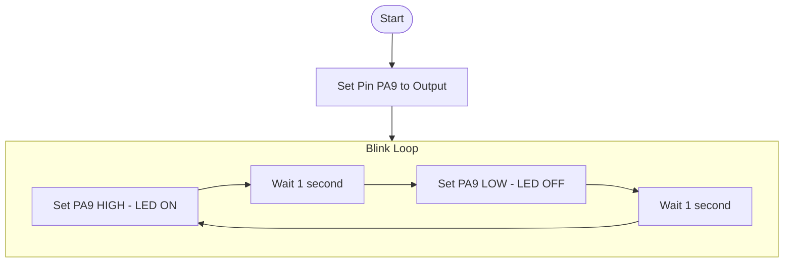
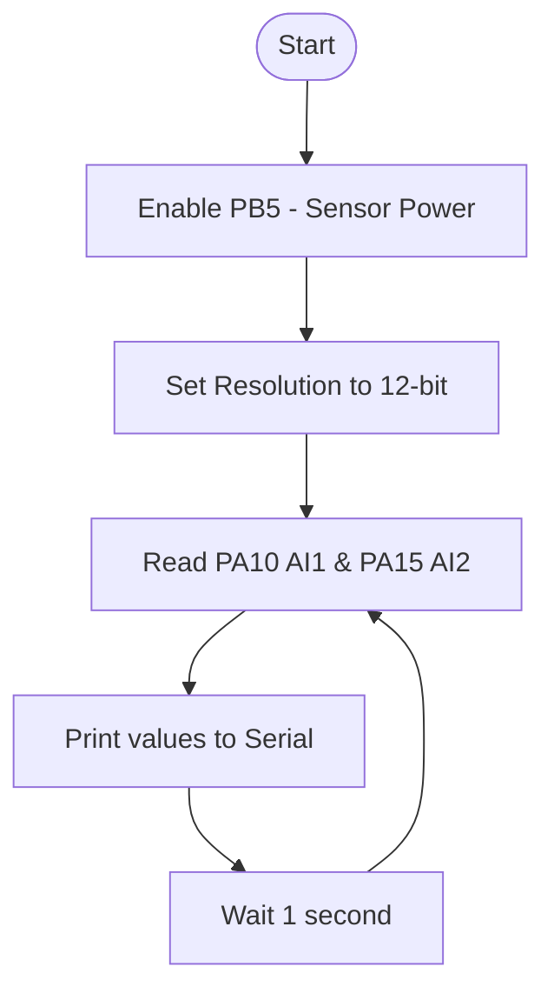
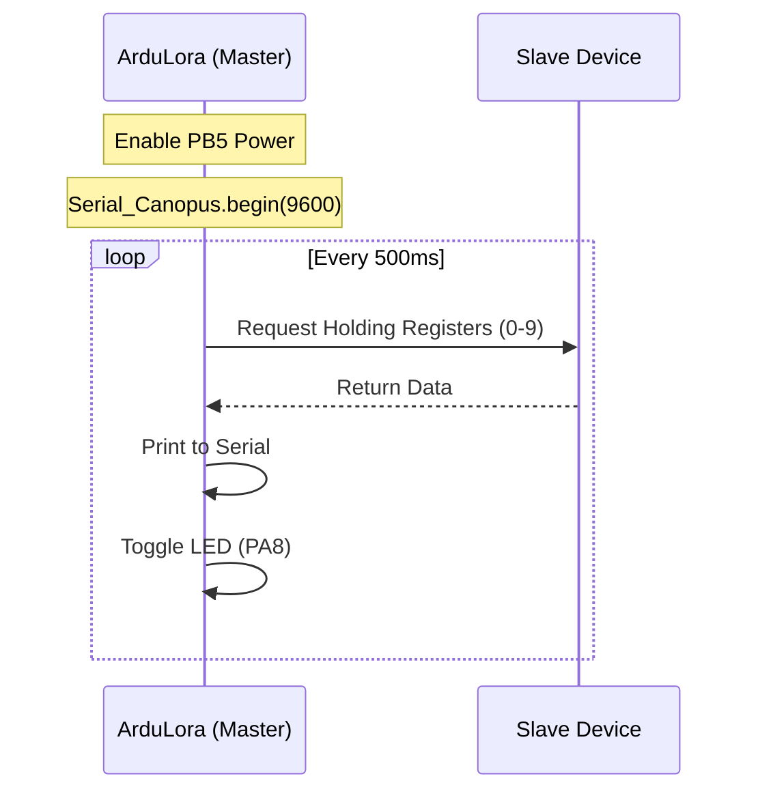
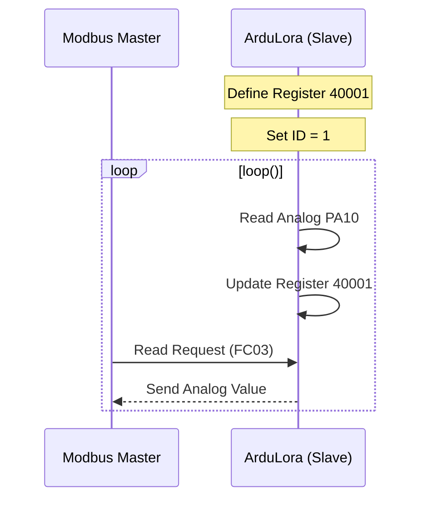
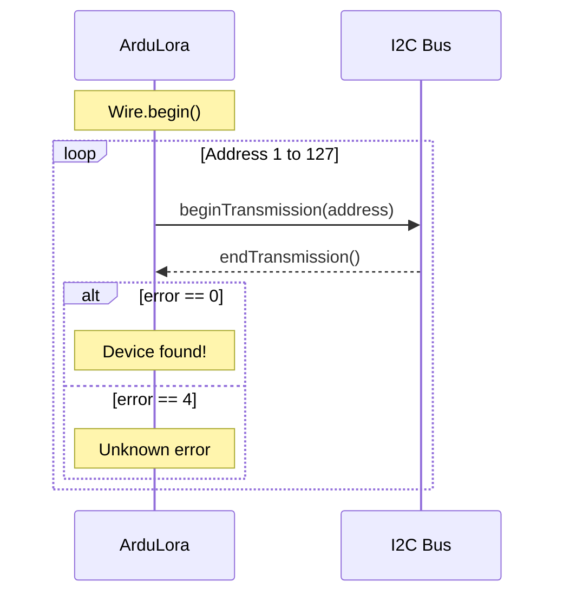
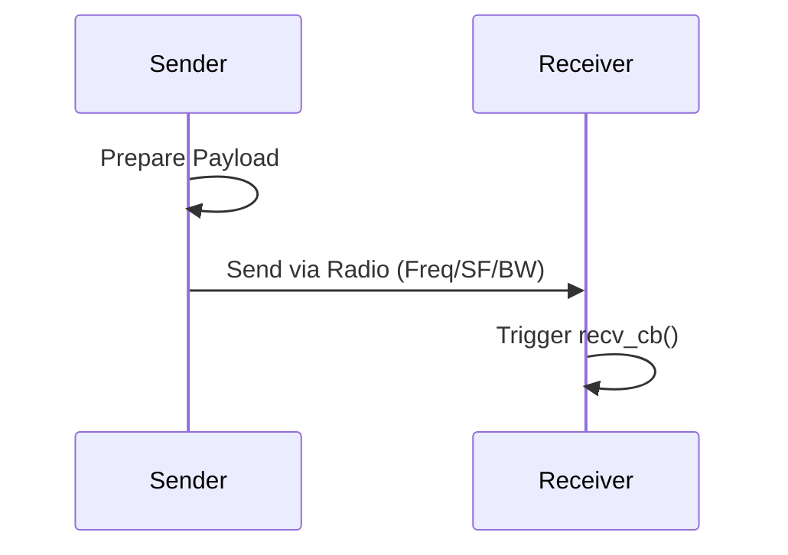
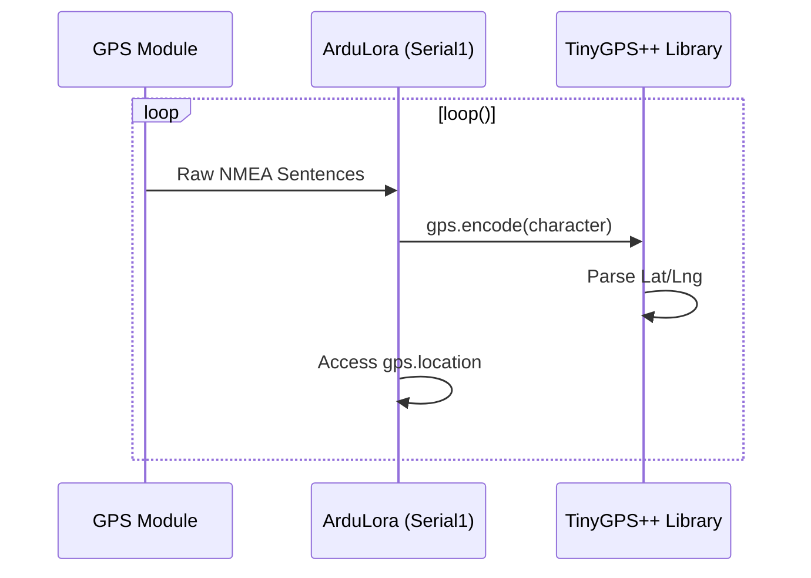

# Examples and Programming Guide for ArduLora

Welcome to the **ArduLora Programming Guide**. This document contains step-by-step examples, connection diagrams, flow charts, and detailed explanations for using the various hardware peripherals on the ArduLora board with the **Arduino IDE** and **RUI3 (v4.2.4+)** APIs.

---

## 📌 Table of Contents

- [Digital I/O (LED Blinking)](#1-digital-io-led-blinking)
- [Analog Input (Sensor Reading)](#2-analog-input-sensor-reading)
- [Modbus RTU (Industrial RS485)](#3-modbus-rtu-industrial-rs485)
  - [Modbus Master](#modbus-master)
  - [Modbus Slave](#modbus-slave)
- [I2C Communication](#4-i2c-communication)
  - [I2C Scanner](#i2c-scanner)
  - [Read Sensor SHT3x](#read-sensor-sht3x)
  - [Read Sensor BH1750](#read-sensor-bh1750)
- [LoRa P2P (Peer-to-Peer)](#5-lora-p2p-peer-to-peer)
  - [Sender Code](#sender-code)
  - [Receiver Code](#receiver-code)
- [System Functions](#6-system-functions)
  - [Deep Sleep (Powersave)](#deep-sleep-powersave)
  - [System Time (Millis/Micros)](#system-time-millismicros)
  - [System Timers](#system-timers)
  - [General Info & Reboot](#general-info--reboot)
- [GPS (ATGM336H Integration)](#7-gps-atgm336h-integration)

---

> [!IMPORTANT]
> **RUI3 v4.2.4 API Compliance:** All code examples are optimized for the latest RUI3 v4.x namespaces (e.g., using `api.lora.*`). Make sure your RAK3172 module's firmware is up to date.

---

## 1. Digital I/O (LED Blinking)

Use the standard Arduino `digitalWrite` and `digitalRead` functions to control and monitor digital pins.

> [!TIP]
> Always use the **GPIO Pin Name** (e.g., `PA9`) in your code instead of raw physical pin numbers.

### Flowchart


### Example Code
```c
void setup()
{
  pinMode(PA9, OUTPUT); // Set pin PA9 as an OUTPUT (Red LED)
}

void loop()
{
  digitalWrite(PA9, HIGH); // Turn the LED ON (3.3V)
  delay(1000);             // Wait for 1 second
  digitalWrite(PA9, LOW);  // Turn the LED OFF (0V)
  delay(1000);             // Wait for 1 second
}
```

🔍 **Code Explanation:**
*   **`pinMode(PA9, OUTPUT)`**: Tells the microcontroller that pin `PA9` will output voltage (driving the LED).
*   **`digitalWrite(PA9, HIGH)`**: Outputs 3.3V to the pin, turning the LED on.
*   **`delay(1000)`**: Pauses execution for 1000 milliseconds.

[Back to Top](#-table-of-contents)

---

## 2. Analog Input (Sensor Reading)

ArduLora provides dual onboard analog input channels capable of scaling higher voltage signals.

### Analog Pins Map
| **Pin Name** | **Onboard Label** |
| ------------ | ----------------- |
|  `PA10`       | AI1               |
|  `PA15`       | AI2               |

### Logic Flow


### Example Code
```c
void setup() {
  Serial.begin(115200);
  Serial.println("ArduLora Analog Example");
  Serial.println("------------------------------------------------------");
  
  // Enable power for external sensors
  pinMode(PB5, OUTPUT);
  digitalWrite(PB5, LOW);
  
  analogReadResolution(12);  // Set analog read resolution to 12 bits (0-4095)
}

void loop() {
  float AI1 = analogRead(PA10) * 2.58;       // Read AI1 and convert to millivolts
  Serial.printf("AI1 = %0.0fmV\r\n", AI1);

  float AI2 = analogRead(PA15) * 2.58;       // Read AI2 and convert to millivolts
  Serial.printf("AI2 = %0.0fmV\r\n", AI2);

  delay(1000);  // Wait for 1 second
}
```

🔍 **Code Explanation:**
*   **`pinMode(PB5, OUTPUT)` & `digitalWrite(PB5, LOW)`**: Controls the sensor power gate pin (`PB5`). It must be driven **LOW** to supply power to external sensors.
*   **`analogReadResolution(12)`**: Increases ADC resolution to 12-bit for improved precision.
*   **`analogRead(PA10) * 2.58`**: Converts the ADC reading to actual millivolts based on the board's resistor dividers and voltage scaling.

[Back to Top](#-table-of-contents)

---

## 3. Modbus RTU (Industrial RS485)

Modbus RTU uses Hardware Serial1 (`Serial_Canopus` alias) on the ArduLora board.

| **Serial Port**   | **Serial Instance Assignment** |
| ----------------- | ------------------------------ |
| UART1 (pins 4, 5) | `Serial1` (`Serial_Canopus`)    |


### Modbus Master

In this example, ArduLora acts as the Modbus Master requesting holding registers from a Modbus Slave.

#### Data Flow


#### Example Code
> [!NOTE]
> Make sure you have a Modbus RTU slave device connected to the A and B terminals of the ArduLora board.

```c
#include "Canopus_Modbus.h"
ModbusMaster node;
uint8_t result;

void setup()
{
  // Enable power for external sensor/transceiver
  pinMode(PB5, OUTPUT);
  digitalWrite(PB5, LOW);

  // Status LED pin PA8 as output
  pinMode(PA8, OUTPUT);
  Serial.begin(115200);
  Serial.print("\r\n*****************ArduLora Modbus Master*******************");
  
  // Initialize Modbus RTU communication at 9600 baud
  Serial_Canopus.begin(9600, SERIAL_8N1);
}

void loop()
{
  // Set communication target to Slave ID 1
  node.begin(1, Serial_Canopus);
  Serial.printf("\r\n\n\nExample read modbus RTU for ArduLora board");

  // Read 10 holding registers starting at address 0 (40000 to 40009)
  result = node.readHoldingRegisters(0, 10);
  delay(10);
  
  if (result == node.ku8MBSuccess) // Read successful
  {
    for (uint8_t i = 0; i < 10; i++)
    {
      Serial.printf("\r\nValue 4000%d: %d", i, node.getResponseBuffer(i));
    }
  }
  else {
    Serial.print("Read Fail node 1");
  }
  
  digitalWrite(PA8, !digitalRead(PA8)); // Toggle status LED
  delay(500);
}
```

🔍 **Code Explanation:**
*   **`ModbusMaster node`**: Instantiates a Modbus master object.
*   **`Serial_Canopus`**: Hardware Serial helper mapped to RS485 transceivers.
*   **`node.readHoldingRegisters(0, 10)`**: Sends a Modbus Function Code 03 query to read registers 0-9.
*   **`node.getResponseBuffer(i)`**: Reads the response register data from buffer.

[Back to Top](#-table-of-contents)

---

### Modbus Slave

In this example, ArduLora acts as a Modbus Slave. It reads local analog values and updates its holding registers to be polled by a Master.

#### Data Flow


#### Example Code
```c
#include "modbus.h"
#include "modbusDevice.h"
#include "modbusRegBank.h"
#include "modbusSlave.h"

modbusDevice regBank;
modbusSlave slave;

void setup()
{
  // Enable power for external transceiver/sensor
  pinMode(PB5, OUTPUT);
  digitalWrite(PB5, LOW);

  // Status LED PA8
  pinMode(PA8, OUTPUT);
  Serial.begin(115200);
  Serial.print("\r\n*****************ArduLora Modbus Slave*******************");
  
  regBank.setId(1);            // Set Modbus Slave ID to 1
  regBank.add(40001);          // Add holding register 40001 (Address 1, FC03)
  regBank.set(40001, 0);       // Initialize register 40001 with 0
  
  slave._device = &regBank;
  slave.setBaud(9600);         // Set Modbus baudrate to 9600
  
  analogReadResolution(12);    // Set ADC resolution to 12-bit
}

void loop()
{
  int analog_In = analogRead(PA10); 
  
  regBank.set(40001, analog_In); // Update holding register with local ADC reading
  slave.run();                  // Run Modbus state machine service
  
  digitalWrite(PA8, !digitalRead(PA8)); // Blink LED
  delay(200);
}
```

🔍 **Code Explanation:**
*   **`regBank.setId(1)`**: Defines Modbus Slave Address.
*   **`regBank.add(40001)`**: Registers a holding register that is read/write accessible.
*   **`slave.run()`**: Listens to RS485 UART requests, parses packages, and responds automatically.

[Back to Top](#-table-of-contents)

---

## 4. I2C Communication

ArduLora has one physical I2C port mapped as follows:

| **I2C Signal** | **Microcontroller Pin** |
| -------------- | ---------------------- |
| `I2C_SCL`      | `PA12`                 |
| `I2C_SDA`      | `PA11`                 |

### I2C Scanner

Scans the I2C bus for any connected peripherals.

#### Flowchart


#### Example Code
```c
#include <Wire.h>

void setup()
{
  pinMode(PB5, OUTPUT);
  digitalWrite(PB5, LOW); // Supply I2C pull-up and sensor power
  
  Wire.begin();
  Serial.begin(115200);
  while (!Serial);
  Serial.println("\nI2C Scanner");
}

void loop()
{
  byte error, address;
  int nDevices = 0;
  Serial.println("Scanning...");
  
  for(address = 1; address < 127; address++)
  {
    Wire.beginTransmission(address);
    error = Wire.endTransmission();
    
    if (error == 0)
    {
      Serial.print("I2C device found at address 0x");
      if (address < 16) Serial.print("0");
      Serial.print(address, HEX);
      Serial.println(" !");
      nDevices++;
    }
    else if (error == 4)
    {
      Serial.print("Unknown error at address 0x");
      if (address < 16) Serial.print("0");
      Serial.println(address, HEX);
    }
  }
  
  if (nDevices == 0)
    Serial.println("No I2C devices found\n");
  else
    Serial.println("done\n");
    
  delay(5000); // Scan every 5 seconds
}
```

[Back to Top](#-table-of-contents)

---

### Read Sensor SHT3x

Reads temperature and relative humidity from an SHT3x series sensor.

```c
#include <Arduino.h>
#include <Wire.h>
#include <ArduLora_SHT3x.h>

ArduLora_SHT3x sht3x(0x44, &Wire); // I2C Address: 0x44 (or 0x45 if jumpered)

void setup() {
  Serial.begin(115200);
  Serial.print("\r\n************ ArduLora SHT3x Example **************");
  
  // Enable power for sensor
  pinMode(PB5, OUTPUT);
  digitalWrite(PB5, LOW);
  delay(100);
  
  Wire.begin();
  while (!sht3x.begin()) {
    Serial.println("SHT3x not found!");
    delay(1000);
  }
}

void loop() {
  if (sht3x.measure()) {
    Serial.print("Temperature: ");
    Serial.print(sht3x.temperature(), 1);
    Serial.print(" *C\tHumidity: ");
    Serial.print(sht3x.humidity(), 1);
    Serial.println(" %RH");
  } else {
    Serial.println("SHT3x read error");
  }
  delay(1000);
}
```

[Back to Top](#-table-of-contents)

---

### Read Sensor BH1750

Reads light intensity (Lux) from a BH1750 light sensor.

```c
#include <Arduino.h>
#include <Wire.h>
#include <ArduLora_BH1750.h>

ArduLora_BH1750 bh1750(0x23, &Wire); // Address: 0x23 (or 0x5C if jumpered)

void setup() {
  Serial.begin(115200);
  Serial.print("\r\n************ ArduLora BH1750 Example **************");
  
  // Enable sensor power
  pinMode(PB5, OUTPUT);
  digitalWrite(PB5, LOW);
  
  Wire.begin();
  while (!bh1750.begin()) {
    Serial.println("BH1750 not found!");
    delay(1000);
  }
}

void loop() {
  Serial.print("Light: ");
  Serial.print(bh1750.light());
  Serial.println(" lx");
  delay(1000);
}
```

🔍 **Code Explanation:**
*   **`sht3x.measure()` / `bh1750.light()`**: Library functions that query sensors via standard I2C frames and retrieve raw digital data.
*   `PB5` is essential here because the onboard I2C pull-ups are powered via the sensor power line.

[Back to Top](#-table-of-contents)

---

## 5. LoRa P2P (Peer-to-Peer)

LoRa Peer-to-Peer allows two boards to communicate directly over radio frequencies without gateway infrastructure.

### Data Flow


---

### Sender Code

Sends a "Hello ArduLora P2P" packet every 5 seconds.

```c
#include <ArduLora.h>

long startTime;
bool rx_done = false;

void hexDump(uint8_t *buf, uint16_t len) {
  for (uint16_t i = 0; i < len; i += 16) {
    char s[len];
    uint8_t iy = 0;
    for (uint8_t j = 0; j < 16; j++) {
      if (i + j < len) {
        uint8_t c = buf[i + j];
        if (c > 31 && c < 128)
          s[iy++] = c;
      }
    }
    String msg = String(s);
    Serial.println(msg);
  }
}

// Receive callback (triggered when a message is received)
void recv_cb(rui_lora_p2p_recv_t data) {
  rx_done = true;
  if (data.BufferSize == 0) {
    Serial.println("Empty buffer.");
    return;
  }
  ArduLora.setLed(ARDULORA_LED_RX, true); // Turn on RX LED
  char buff[92];
  sprintf(buff, "Incoming message, length: %d, RSSI: %d, SNR: %d",
          data.BufferSize, data.Rssi, data.Snr);
  Serial.println(buff);
  hexDump(data.Buffer, data.BufferSize);
  ArduLora.setLed(ARDULORA_LED_RX, false); // Turn off RX LED
}

// Send callback (triggered when transmission finishes)
void send_cb(void) {
  Serial.printf("P2P set Rx mode %s\r\n", api.lora.precv(65534) ? "Success" : "Fail");
}

void setup() {
  Serial.begin(115200);
  Serial.println("ArduLora P2P TX Example (Using OOP Library)");
  Serial.println("------------------------------------------------------");
  
  // 1. Initialize board LEDs and peripherals
  ArduLora.begin();
  ArduLora.sensorPower(true); // Turn on sensor power rail
  
  startTime = millis();

  // 2. Configure P2P settings (Default: 868MHz, SF7, BW125, CR4/5, Preamble 8, TX Power 22)
  if (ArduLora.configLoraP2P()) {
    Serial.println("LoRa P2P configured successfully!");
  }

  // 3. Register callbacks for RX and TX events
  api.lora.registerPRecvCallback(recv_cb);
  api.lora.registerPSendCallback(send_cb);
  
  // Enter RX listening mode
  api.lora.precv(65534); 
}

void loop() {
  uint8_t payload[] = "Hello ArduLora P2P";
  bool send_result = false;
  
  while (!send_result) {
    api.lora.precv(0); // Stop RX mode before sending a packet
    send_result = ArduLora.sendP2P(payload, sizeof(payload));
    if (!send_result) {
      delay(1000);
    }
  }
  
  Serial.println("Send successful!");
  delay(5000);
  
  static bool ledState = false;
  ledState = !ledState;
  ArduLora.setLed(ARDULORA_LED_TX, ledState); // Toggle TX LED
}
```

[Back to Top](#-table-of-contents)

---

### Receiver Code

Receives packets and sends back an ACK confirmation.

```c
#include <ArduLora.h>

long startTime;
bool rx_done = false;

void recv_cb(rui_lora_p2p_recv_t data) {
  rx_done = true;
  if (data.BufferSize == 0) {
    Serial.println("Empty buffer.");
    return;
  }
  ArduLora.setLed(ARDULORA_LED_RX, true);
  char buff[92];
  sprintf(buff, "Incoming message, length: %d, RSSI: %d, SNR: %d",
          data.BufferSize, data.Rssi, data.Snr);
  Serial.println(buff);
  ArduLora.setLed(ARDULORA_LED_RX, false);
}

void send_cb(void) {
  Serial.printf("P2P set Rx mode %s\r\n", api.lora.precv(65534) ? "Success" : "Fail");
}

void setup() {
  Serial.begin(115200);
  Serial.println("ArduLora P2P RX Example");
  Serial.println("------------------------------------------------------");
  
  ArduLora.begin();
  ArduLora.sensorPower(true);
  
  startTime = millis();

  if (ArduLora.configLoraP2P()) {
    Serial.println("LoRa P2P configured successfully!");
  }

  api.lora.registerPRecvCallback(recv_cb);
  api.lora.registerPSendCallback(send_cb);
  
  api.lora.precv(65534); // Continuous receive mode
}

void loop() {
  uint8_t payload[] = "ACK from ArduLora";
  bool send_result = false;
  
  if (rx_done) {
    rx_done = false;
    while (!send_result) {
      ArduLora.setLed(ARDULORA_LED_TX, true);
      api.lora.precv(0); // Stop RX
      send_result = ArduLora.sendP2P(payload, sizeof(payload));
      if (!send_result) {
        delay(1000);
      }
    }
    ArduLora.setLed(ARDULORA_LED_TX, false);
  }
  
  delay(500);
  static bool ledState = false;
  ledState = !ledState;
  ArduLora.setLed(ARDULORA_LED_STATUS, ledState);
}
```

[Back to Top](#-table-of-contents)

---

## 6. System Functions

Control advanced MCU system actions including deep sleep, timer tasks, and hardware settings.

### Deep Sleep (Powersave)

Puts the MCU and LoRa transceiver into low-power sleep mode.

```c
void setup()
{
    Serial.begin(115200);
    Serial.println("RAKwireless System Powersave Example");
    Serial.println("------------------------------------------------------");
}

void loop()
{
    Serial.print("The timestamp before sleeping: ");
    Serial.print(millis());
    Serial.println(" ms");
    Serial.println("(Wait 10 seconds or Press any key to wakeup)");
    
    // Put MCU into sleep mode for 10,000 ms (10 seconds)
    api.system.sleep.all(10000);
    
    Serial.print("The timestamp after sleeping: ");
    Serial.print(millis());
    Serial.println(" ms");
}
```

🔍 **Code Explanation:**
*   **`api.system.sleep.all(10000)`**: Shuts down internal peripherals and enters standby/deep-sleep mode, drawing negligible battery current. It wakes up when the timer expires or when external UART activity is detected.

[Back to Top](#-table-of-contents)

---

### System Time (Millis/Micros)

Retrieves microseconds or milliseconds elapsed since board initialization.

```c
long delayTime = 1000;

void setup()
{
    Serial.begin(115200);
    Serial.println("RAKwireless Arduino Time Example");
    Serial.println("------------------------------------------------------");
}

void loop()
{
    Serial.println("Now Time:");
    Serial.printf("millis(): %lu ms\n", millis());
    Serial.printf("micros(): %lu us\n", micros());
  
    Serial.printf("After Delay %lu milliseconds\n", delayTime);
    delay(delayTime);
    
    Serial.printf("millis(): %lu ms\n", millis());
    Serial.printf("micros(): %lu us\n", micros());
  
    Serial.printf("After Delay %lu microseconds\n", delayTime);
    delayMicroseconds(delayTime);
    
    Serial.printf("millis(): %lu ms\n", millis());
    Serial.printf("micros(): %lu us\n", micros());
  
    Serial.println("");
    delayTime += 1000;
    delay(5000);
}
```

[Back to Top](#-table-of-contents)

---

### System Timers

Utilizes hardware system timers to trigger callback functions periodically without polling in the loop.

```c
void handler(void *data)
{
    Serial.printf("[%lu] This is the handler of timer #%d\r\n", millis(), (int)data);
}

void setup()
{
    Serial.begin(115200);
    Serial.println("RAKwireless System Timer Example");
    Serial.println("------------------------------------------------------");
  
    // Create and start multiple timers based on IDs
    for (int i = 0; i < RAK_TIMER_ID_MAX; i++) {
        if (api.system.timer.create((RAK_TIMER_ID)i, (RAK_TIMER_HANDLER)handler, RAK_TIMER_PERIODIC) != true) {
            Serial.printf("Creating timer #%d failed.\r\n", i);
            continue;
        }
        if (api.system.timer.start((RAK_TIMER_ID)i, (i + 1) * 1000, (void *)i) != true) {
            Serial.printf("Starting timer #%d failed.\r\n", i);
            continue;
        }
    }
}

void loop()
{
    // Empty - execution is handled asynchronously by timer callbacks!
}
```

[Back to Top](#-table-of-contents)

---

### General Info & Reboot

Queries general info (Firmware versions, unique ID, battery level) and reboots the module.

```c
int i = 0;

void setup()
{
    Serial.begin(115200);
    Serial.println("RAKwireless System General Example");
    Serial.println("------------------------------------------------------");
    api.system.restoreDefault(); // Resets default RUI3 settings
}

void loop()
{
    if (++i == 20) {
        Serial.printf("Reboot now..\r\n");
        api.system.reboot(); // Software reboot
    }
    
    Serial.printf("===Loop %d==\r\n", i);
    Serial.printf("Firmware Version: %s\r\n", api.system.firmwareVersion.get().c_str());
    Serial.printf("AT Command Version: %s\r\n", api.system.cliVersion.get().c_str());
    Serial.printf("RUI API Version: %s\r\n", api.system.apiVersion.get().c_str());
    Serial.printf("Model ID: %s\r\n", api.system.modelId.get().c_str());
    Serial.printf("Hardware ID: %s\r\n", api.system.chipId.get().c_str());
    Serial.printf("Battery Level: %0.1f\r\n", api.system.bat.get());
    
    delay(1000);
}
```

[Back to Top](#-table-of-contents)

---

## 7. GPS (ATGM336H Integration)

Reads raw NMEA strings from an external GPS Module (like the ATGM336H) using hardware `Serial1` and parses position fixes via the `TinyGPS++` library.

### Data Flow


### Example Code
```c
#include <TinyGPSPlus.h>

TinyGPSPlus gps;

void setup() {
  Serial.begin(115200);
  Serial1.begin(9600); // GPS usually communicates at 9600 baud
  
  // Enable sensor power rail (provides VCC to GPS module)
  pinMode(PB5, OUTPUT);
  digitalWrite(PB5, LOW);
  
  // Clear any junk in buffer
  while (Serial1.available()) {
    Serial1.read();
  }
}

void loop() {
  // Feed characters to GPS parser
  while (Serial1.available() > 0) {
    gps.encode(Serial1.read());
  }
  
  if (gps.location.isUpdated()) {
    float gps_lat = gps.location.lat();
    float gps_lng = gps.location.lng();
    float gps_speed = gps.speed.mps();
    
    Serial.printf("Latitude: %0.6f, Longitude: %0.6f, Speed: %0.2f m/s\r\n", 
                  gps_lat, gps_lng, gps_speed);
  }
}
```

[Back to Top](#-table-of-contents)
